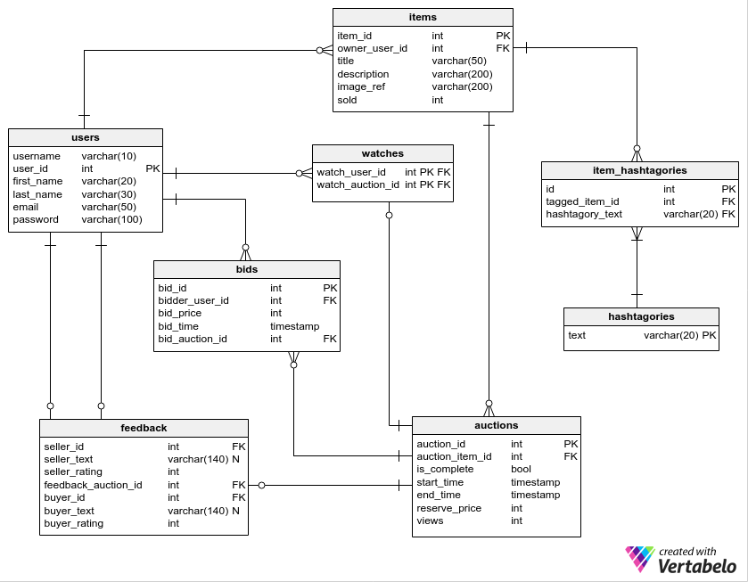

# GC06 Database Design Report
### YouTube Video Link

[Link to YouTube Video](https://www.youtube.com)

### Entity Relationship Diagram




### Database Schema Listing
Users username

### Database 3rd Normal form analysis
A database is in 3rd normal form if it meets 3 critia
1. It contains only atomic values.
2. All non-key attributes are fully functional dependent on the primary key.
3. There is no transitive functional dependency.

#### 1st Normal Form
All of our eight tables contain only atomic values meaning that there are not any elements in any of the tables where the data can be split up. i.e. username is atomic, email is atomic, an item_description is atomic. The database is in first normal form.

#### 2nd Normal Form
This effectively means that in every table in the database a value of a particular non-key field cannot be uniquely identified via another non-key or group of non-key fields. 


### Query Explainations

#### auctions_cancel
Cancels an auction by deleting it from the auction table. 
```
PROCEDURE `auctions_cancel`(IN auction_id INT(11))
BEGIN
	DELETE FROM `auctions` WHERE auctions.auction_id = auction_id;
END *
```


#### auctions_close
Closes an auction (sets a boolean flag to 1)
```
PROCEDURE `auctions_close`(IN auction_id INT)
BEGIN
    UPDATE auctions
    SET is_complete=1
    WHERE auctions.auction_id=auction_id;
END *
```

#### auctions_create
Starts an auction, using timestamps generated in the middle-layer (could have also used NOW() function). Reserve price needs to be cast from string input.
```
PROCEDURE `auctions_create`(IN auction_item_id INT(11), IN start_time timestamp, IN end_time timestamp, IN reserve_price varchar(12))
BEGIN
    INSERT INTO `auctions` (auctions.auction_item_id, auctions.start_time, auctions.end_time, auctions.reserve_price)  
    VALUES(auction_item_id, start_time, end_time, CAST(reserve_price AS DECIMAL(10,2)));
    SELECT last_insert_id();
END *
```

#### auctions_retrieve_all
Shows a set of auction  objects with user name, item details and auction details, as well as highest bid. Highest bids needed to be selected into a subtable and then joined to cope with some auctions not having bids placed.
```
PROCEDURE `auctions_retrieve_all`()
BEGIN
        select a.*, b.current_bid, i.*, u.username from auctions as a
    Left Join (select bids.bid_auction_id, max(bids.bid_price) as `current_bid` from bids group by bid_auction_id) as b
        ON a.auction_id = b.bid_auction_id
    Left Join items as i
        ON i.item_id = a.auction_item_id
    Left JOIN users as u
        ON u.user_id = i.owner_user_id
    WHERE a.is_complete = 0
    ORDER BY a.end_time ASC;
END *
```

#### auctions_search
Allows for a partial search of auctions, returning auction items with item and user details. 

```

PROCEDURE `auctions_search`(IN str varchar(20))
BEGIN
    SELECT DISTINCT a.*, i.*, u.username
    FROM item_hashtagories AS ih, auctions AS a, items AS i, users AS u
	
    WHERE MATCH(ih.hashtagory_text) AGAINST(str IN BOOLEAN MODE)    
		AND a.is_complete = 0
		AND ih.tagged_item_id = i.item_id
        AND a.auction_item_id = i.item_id
        AND i.owner_user_id = u.user_id;
END *
```

#### auctions_self
Returns the information about a particular auction (bids are pulled in seperately for display purposes)
```
PROCEDURE `auctions_self`(IN auction_id INT(11))
BEGIN
SELECT items.*, users.username, auctions.* FROM `auctions`
    LEFT JOIN `items` ON auctions.auction_item_id = items.item_id
    LEFT JOIN `users` ON items.owner_user_id = users.user_id
    WHERE auctions.auction_id = auction_id;
END *
```

#### auctions_user_auctions
Returns all auctions created by a particular user
```
PROCEDURE `auctions_user_auctions`(IN user_id INT(11))
BEGIN
	SELECT * FROM `auctions` AS a, `items` AS i
    WHERE a.is_complete = 0
    AND a.auction_item_id = i.item_id
    AND i.owner_user_id = user_id
    ORDER BY `end_time` ASC;
END *
```

#### auctions_user_feed
Returns a feed of auctions relevant to the bids that they have made
```
PROCEDURE `auctions_user_feed`(IN user_id INT(11))
BEGIN
	SELECT * FROM auctions as a
	LEFT JOIN items as i ON a.auction_item_id = i.item_id
	LEFT JOIN bids as b ON a.auction_id = b.bid_auction_id
	WHERE b.bidder_user_id = user_id AND a.is_complete = 0
    ORDER BY a.end_time ASC;
END *
```

#### bids_auction_bids
Returns the set of bids on any given auction
```
PROCEDURE `bids_auction_bids`(IN bid_auction_id INT(11))
BEGIN
	SELECT * FROM bids WHERE bids.bid_auction_id = bid_auction_id
    ORDER BY bids.bid_price DESC;
END *
```

#### bids_create
Procedure called when bid is placed on item. Bid value validation (that new bid is the higest) can be performed on the front-end

```
PROCEDURE `bids_create`( IN bidder_user_id INT(11), IN bid_price VARCHAR(12), IN bid_auction_id INT)
BEGIN
INSERT INTO `bids` (bids.bidder_user_id, bids.bid_price, bids.bid_time, bids.bid_auction_id)
    VALUES(bidder_user_id, CAST(bid_price AS DECIMAL(10,2)), NOW(), bid_auction_id);
SELECT last_insert_id();
END *
```

#### bids_self
Returns the auction that a bid is related to
```
PROCEDURE `bids_self`(IN bid_id INT(11))
BEGIN
	SELECT * FROM auctions AS a
    LEFT JOIN items AS i ON a.auction_item_id = i.item_id
    LEFT JOIN bids as b ON a.auction_id = b.bid_auction_id
    WHERE b.bid_id = bid_id;
END *
```

#### bids_user_bids
Returns auction data objects on which a given user has bid (auction details, item deails and bid details)
```
PROCEDURE `bids_user_bids`(IN user_id INT(11))
BEGIN
	SELECT * FROM auctions AS a
    LEFT JOIN items AS i ON a.auction_item_id = i.item_id
    LEFT JOIN bids AS b ON a.auction_id = b.bid_auction_id
    WHERE user_id = b.bidder_user_id;
END *
```

#### event_end_expired_auctions
Ends all expired auctions and returns the data on the auctions such as the buyer, seller, name, winning bid etc...
```
PROCEDURE `event_end_expired_auctions`()
BEGIN

DECLARE reserve_price_tmp INT DEFAULT 0;
DECLARE highest_bid_tmp decimal(10,2) DEFAULT 0;
DECLARE auction_id_tmp INT DEFAULT 0;

DECLARE item_title_tmp varchar(200) DEFAULT 0;
DECLARE item_id_tmp INT DEFAULT 0;

DECLARE seller_url_tmp varchar(200) DEFAULT 0;
DECLARE buyer_url_tmp varchar(200) DEFAULT 0;
DECLARE seller_username_tmp varchar(200) DEFAULT 0;
DECLARE buyer_username_tmp varchar(200) DEFAULT 0;
DECLARE seller_email_tmp varchar(200) DEFAULT 0;
DECLARE buyer_email_tmp varchar(200) DEFAULT 0;
DECLARE seller_id_tmp INT DEFAULT 0;
DECLARE buyer_id_tmp INT DEFAULT 0;

DECLARE successful_tmp INT DEFAULT 0;

DECLARE n INT DEFAULT 0;
DECLARE i INT DEFAULT 0;

	# Drops the temporary table if it exists. Then creates it.
	DROP TABLE IF EXISTS `tmp_end_expired_auctions`;
	CREATE TABLE `tmp_end_expired_auctions` (
	  `auction_id` int(11) NOT NULL,
	  `seller_username` varchar(200) DEFAULT NULL,
	  `seller_email` varchar(200) DEFAULT NULL,
	  `seller_feedback_url` varchar(50) DEFAULT NULL,
	  `buyer_username` varchar(200) DEFAULT NULL,
	  `buyer_email` varchar(200) DEFAULT NULL,
	  `buyer_feedback_url` varchar(50) DEFAULT NULL,
	  `item_title` varchar(200) DEFAULT NULL,
	  `final_bid_price` varchar(200) DEFAULT NULL,
	  `successful` varchar(200) DEFAULT NULL,
	  PRIMARY KEY (`auction_id`)
	) ENGINE=InnoDB DEFAULT CHARSET=latin1;

	SELECT count(*) FROM `auctions` WHERE end_time < now() AND is_complete=0 INTO n;	

	# This loops through the unclosed auctions in the auctions table select values
	# from other tables. It evaluates whether an auction failed or was successful
	# every loop inserts a row to the tmp table.
	SET i=0;
	WHILE i<n DO 

		# Auction table selects. Gets the auction_id, reserver_price and item_id.
		SELECT auction_id, reserve_price, auction_item_id  FROM `auctions` 
		WHERE end_time < now() AND is_complete=0 ORDER BY auction_id LIMIT i, 1 
			INTO auction_id_tmp, reserve_price_tmp, item_id_tmp;

		# Bids table selects. Gets the highest_bid on an item, and the user_id
		# of that bid.
		SELECT bid_price, bidder_user_id FROM `bids`
		WHERE bid_auction_id = auction_id_tmp ORDER BY bid_price DESC LIMIT 1
			INTO highest_bid_tmp, buyer_id_tmp;

		# Items table selects. Gets the user_id of the seller and the items title.
		SELECT owner_user_id, title FROM `items` 
		WHERE item_id = item_id_tmp INTO seller_id_tmp, item_title_tmp;

		# Users table selects seller. Gets seller username and email.
		SELECT username, email FROM `users`
		WHERE user_id = seller_id_tmp INTO seller_username_tmp, seller_email_tmp;


		# If it was successful and there is a buyer user_id
		IF buyer_id_tmp > 0 THEN
			# Users table selects buyer. Gets buyer username and email. 
			SELECT username, email FROM `users`
			WHERE user_id = buyer_id_tmp INTO buyer_username_tmp, buyer_email_tmp;

		END IF;

		# If successful auction: create feedback, set successful to 1
		IF highest_bid_tmp >= reserve_price_tmp AND highest_bid_tmp > 0 THEN
			
			# Create feedback
			INSERT IGNORE INTO `feedback`
				(`seller_id`,
				`feedback_auction_id`,
				`buyer_id`)
				VALUES
				(seller_id_tmp,
				auction_id_tmp,
				buyer_id_tmp);

			# Sold field in items is set to the buyer id.
			UPDATE `items` SET sold = buyer_id_tmp WHERE item_id = item_id_tmp;
	
			# Sets successful.
			SET successful_tmp = 1;
			SET seller_url_tmp = CONCAT('#/feedback?', seller_id_tmp);
			SET buyer_url_tmp = CONCAT('#/feedback?', buyer_id_tmp);

		ELSE 

			SET successful_tmp = 0;

		END IF;

		# Inserts all the values into the tmp table.
		INSERT INTO `tmp_end_expired_auctions`
		(`auction_id`,
		`seller_username`,
		`seller_email`,
		`seller_feedback_url`,
		`buyer_username`,
		`buyer_email`,
		`buyer_feedback_url`,
		`item_title`,
		`final_bid_price`,
		`successful`)
		VALUES
		(auction_id_tmp,
		seller_username_tmp,
		seller_email_tmp,
		seller_url_tmp,
		buyer_username_tmp,
		buyer_email_tmp,
		buyer_url_tmp,
		item_title_tmp,
		highest_bid_tmp,
		successful_tmp);

		SET i = i + 1;
	END WHILE;

	# Gets row count of tmp table.
	SELECT count(*) FROM `tmp_end_expired_auctions` INTO n;

	# Loops through the tmp table finally updating the is_complete in auctions table
	# to 1.
	SET i=0;
	WHILE i<n DO 
	
		SELECT auction_id FROM `tmp_end_expired_auctions` LIMIT i,1 INTO auction_id_tmp;
		
		# Closes every expired auction
		UPDATE `auctions` SET is_complete = 1 WHERE auction_id = auction_id_tmp;
		
		SET i = i + 1;
	END WHILE;

	# Finally does an output select that is returned to the user.
	SELECT * FROM `tmp_end_expired_auctions`;

	# Drops the tmp table.
	DROP TABLE IF EXISTS `tmp_end_expired_auctions`;
	
End
```

#### feedback_for_auction
Returns all fields for feedback on a given auction based on auction ID

```
PROCEDURE `feedback_for_auction`(IN feedback_auction_id INT(11))
BEGIN
	SELECT * FROM feedback WHERE feedback.feedback_auction_id = feedback_auction_id;
END
```

#### feedback_for_user
Returns all feedback for a user, both where they are a buyer or a seller. This was designed so that the system could display all of a user's feedback on one page.
```
PROCEDURE `feedback_for_user`(IN user_id INT(11))
BEGIN
	SELECT * FROM feedback WHERE user_id = feedback.seller_id OR user_id = feedback.buyer_id;
END
```

#### feedback_update
Updates the feedback table with feedback left by the users. Contains switching logic to allow feedback to be sent to a single PHP endpoint. Once this stored procedure is activated it first identifies whether the user is leaving feedback as a buyer or a seller, then selectively updates the feedback table.

```
PROCEDURE `feedback_update`(IN feedback_text VARCHAR(140), IN feedback_rating DECIMAL(5,2), IN user_id INT(11), IN feedback_auction_id INT(11))
BEGIN
	set @v1 = (select seller_id from feedback where feedback.feedback_auction_id = feedback_auction_id);
	IF @v1 = user_id THEN
		UPDATE feedback SET feedback.seller_text = feedback_text, seller_rating = feedback_rating where feedback.feedback_auction_id = feedback_auction_id;
	ELSE
		UPDATE feedback SET feedback.buyer_text = feedback_text, buyer_rating = feedback_rating where feedback.feedback_auction_id = feedback_auction_id;
    END IF;
END
```

#### hashtagories_all
Returns all possible hashtagories, for the front end to auto-suggest existing hashtagories.
```
PROCEDURE `hashtagories_all`()
BEGIN
SELECT text FROM hashtagories;
END
```

#### hashtagories_search
Searches the hashtagory table for hashtagories that partially match the input string, in order for tbe front-end to be able to search by hashtagory.
```
PROCEDURE `hashtagories_search`(IN str varchar(20))
BEGIN
SELECT text FROM hashtagories
WHERE INSTR(text, str);
END
```

#### hashtagories_self
Updates the hashtagory table if the user tags an item with a hashtagory that doesn't exist
```
PROCEDURE `hashtagories_self`(IN hashtext VARCHAR(20))
BEGIN
	INSERT IGNORE INTO `hashtagories` values(hashtext);
END
```

#### hashtagories_tag_item
Adds a hashtagory to an item, allowing it to be searched at a later point. Structured so that if the hashtagory already exists, the operation will not crash and continue on to the second operation (actually tagging the item)
```
PROCEDURE `hashtagories_tag_item`(IN item_id INT(11), IN hashtag varchar(20))
BEGIN
    INSERT INTO hashtagories VALUES (hashtag);
INSERT IGNORE INTO item_hashtagories (tagged_item_id, hashtagory_text) VALUES(item_id, hashtag);
END
```

#### hashtagories_trending
Returns a ranked and numbered list of hastagories based on their popularity (numbers of items that are associated to them). Takes advantage of the GROUP BY command and COUNT aggregate function to return a ranked, depulicated list

```
PROCEDURE `hashtagories_trending`()
BEGIN
SELECT ih.hashtagory_text, COUNT(*) as count
FROM items i, item_hashtagories ih, auctions a
WHERE i.item_id = ih.tagged_item_id AND a.`auction_item_id` = i.`item_id` AND a.`is_complete` = 0
GROUP BY ih.hashtagory_text ORDER BY count DESC
LIMIT 10;
END
```

#### items_create
Creates an entry in the items table. Called every time an item is added to the system (note that hashtagorising has been encapsulated into a seperate stored procedure)
```
PROCEDURE `items_create`(IN owner_user_id int(11), IN title varchar(50), IN description varchar(200))
BEGIN
	INSERT INTO `items` (`owner_user_id`, `title`, `description`)
    VALUES(owner_user_id, title, description);
    SELECT last_insert_id();
END
```

#### items_delete
Deletes an item from the database.
```
PROCEDURE `items_delete`(IN item_id INT(11))
BEGIN
	DELETE FROM `items` where items.item_id = item_id;
END
```

#### items_self
Returns all details regarding a single item. Uses GROUP_CONCAT to flatten the hashtagories (to which items have a 1..* relationship) into a single string for improved data transmission and display.
```
PROCEDURE `items_self`(in item_id int(11))
BEGIN
	SELECT `item_id`, `owner_user_id`, `title`, `description`, GROUP_CONCAT(`hashtagory_text` ORDER BY `hashtagory_text` SEPARATOR ',') AS 'hashtagory_text'
    FROM `items`, `item_hashtagories`
    WHERE items.item_id = item_id AND item_hashtagories.tagged_item_id = item_id;
END
```

#### items_update
Updates description of item; note that hashtagory updates have been encapsulated into a seperate stored procedure
```
PROCEDURE `items_update`(IN item_id int(11), IN title varchar(50), IN description varchar(200))
BEGIN
	UPDATE `items`
    SET items.title = title, items.description = description
    WHERE items.item_id = item_id;
END
```

#### items_user_items
Returns all items that a user owns, in order for them to review, delete or put them up for auction. Flattens hashtagories (to which items have a 1..* relationship) into a single string for display purposes.
```
PROCEDURE `items_user_items`(IN owner_user_id INT(11))
BEGIN
SELECT `item_id`, `owner_user_id`, `title`, `description`, GROUP_CONCAT(`hashtagory_text` ORDER BY `hashtagory_text` SEPARATOR ',') AS 'hashtagory_text'
    FROM `items` as I LEFT OUTER JOIN `item_hashtagories` as  IH
    ON I.item_id = IH.tagged_item_id
    WHERE I.owner_user_id = owner_user_id
    GROUP BY I.item_id;
END
```

#### users_authenticate
Authentictes users. Checks user name and hashed password against users table, only returns true if both match.
```
PROCEDURE `users_authenticate`(IN username varchar(20), IN password varchar(20))
BEGIN
	select user_id from users where BINARY users.username = username AND BINARY users.password = password;
END
```

#### users_change_password
Two-step password change. New password validation done in front end, if new password is entered correctly twice, this store procedure is triggered. Checks first if old user name / password pair exists, then updates password field.
```
PROCEDURE `users_change_password`(IN userid int(11), IN old_password varchar(20), IN new_password varchar(20))
BEGIN
set @v1 = (select users.user_id from `users` where BINARY users.password = old_password AND users.user_id = userid);
IF @v1 = userid THEN
	UPDATE `users` SET `password`= new_password WHERE `user_id` = userid;
ELSE
	SIGNAL SQLSTATE '45000'
    SET MESSAGE_TEXT = 'INCORRECT USER NAME AND/OR PASSWORD';
END IF;
END
```

#### users_create
Creates a new user. Validates that no fields are empty in the front end, then inserts into user table
```
PROCEDURE `users_create`(
IN username varchar(10),
IN first_name varchar(20),
IN last_name varchar(20),
IN email varchar(50),
IN pass varchar(20)
)
BEGIN
 INSERT INTO `users` (`username`, `first_name`, `last_name`, `email`, `password`)
 values (username, first_name, last_name, email, pass);
END
```

#### users_search
A search for all users whose usernames contain a substring that matches the input
```
PROCEDURE `users_search`(in unstring varchar(20))
BEGIN
	SELECT username FROM users
WHERE INSTR(username, unstring);
END
```

#### users_self
Returns all fields except for password of a particular user
```
PROCEDURE `users_self`(IN user_id int(11))
BEGIN
 SELECT users.username, users.user_id, users.first_name, users.last_name, users.email FROM `users` WHERE users.user_id = user_id;
END
```

#### users_update
Updates a user. First checks that the system is attempting to update a valide user. Accepts empty strings and does not update those fields.
```
PROCEDURE `users_update`(
IN user_id int,
IN username varchar(10),
IN first_name varchar(20),
IN last_name varchar(30),
IN email varchar(50)
)
BEGIN
    IF user_id IS NULL THEN
        SIGNAL SQLSTATE '45000'
            SET MESSAGE_TEXT = 'No user provided';
    END IF;
    IF username IS NOT NULL THEN
        UPDATE `users` SET users.username = username
        WHERE users.user_id = user_id;
    END IF;
    IF first_name IS NOT NULL THEN
        UPDATE `users` SET users.first_name = first_name
        WHERE users.user_id = user_id;
    END IF;
    IF last_name IS NOT NULL THEN
        UPDATE `users` SET users.last_name = last_name
        WHERE users.user_id = user_id;
    END IF;
    IF email IS NOT NULL THEN
        UPDATE `users` SET users.email = email
        WHERE users.user_id = user_id;
    END IF;

END
```

#### users_username
Returns the user name of a user given their numerical ID.
```
PROCEDURE `users_username`(IN id INT(11))
BEGIN
	SELECT username FROM users
    WHERE user_id LIKE id;
END
```

#### watches_create
Adds a 'watch' to the watches table when a user wishes to watch but not bid on an auction.
```
PROCEDURE `watches_create`(IN watch_user_id INT(11), IN watch_auction_id INT(11))
BEGIN
	INSERT IGNORE INTO watches VALUES(watch_user_id, watch_auction_id);
    SELECT last_insert_id();
END
```

#### watches_delete
Removes a particular 'watch' when a user wishes to stop watching an item.
```
PROCEDURE `watches_delete`(IN watch_user_id INT(11), IN watch_auction_id INT(11))
BEGIN
	DELETE FROM watches
    WHERE watches.watch_user_id = watch_user_id
    AND watches.watch_auction_id = watch_auction_id; 
END
```

#### watches_user_watches
Returns all auctions that a user is watching.
```
PROCEDURE `watches_user_watches`(IN user_id INT(11))
BEGIN
	SELECT * FROM auctions AS a
    LEFT JOIN items AS i ON a.auction_item_id = i.item_id
    LEFT JOIN watches AS w ON a.auction_id = w.watch_auction_id
    WHERE w.watch_user_id = user_id;
END
```


