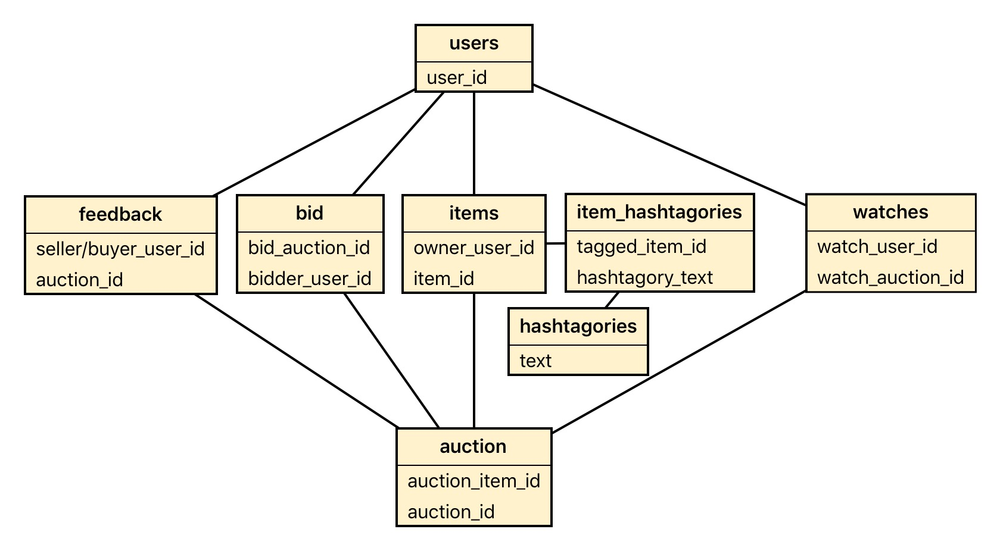

# GC06 Database Design Report
### By Jason Gwartz, Jan Klug and Edward Mothershaw
#### Group 37
\newpage

# Table of Contents


### 1. [Project Overview](#example)
### 2. [YouTube Video Link](#example2)
### 3. [Entity Relationship Diagram](#third-example)
### 4. [Database Schema Listing](#third-example)
### 5. [Application Architecture](#third-example)
### 6. [Normalistation Analysis](#third-example)
### 7. [Query Explainations](#third-example)


\newpage

## Project Overview

This report highlights the implementation of a peer-to-peer online auction system, called **Hashtagories**. The interaction model is based largely on Twitter; product descriptions are limited to 140 characters, and bids on an auction appear like Twitter @-replies. Descriptions include hashtags, which make up the main categorisation and search index.

### Main Features
- Users can add an item to their profile, giving it a title and description (including hashtags)
- A registered item can be put up for auction, with a reserve price (hidden from other users) and end date
- Users can search for items up for auction based on their hashtags
- A user can place a bid on an item up for auction
- At the end time, the auction closes - the seller and highest bidder are notified, and both are invited to leave feedback
- Users can 'watch' an auction, where they will be notified when new bids are placed

## YouTube Video Link

[https://www.youtube.com/watch?v=izUbymUykH4&feature=em-upload_owner](https://www.youtube.com/watch?v=izUbymUykH4&feature=em-upload_owner)

## Entity Relationship Diagram
Figure 1 shows the entity relationship diagram that was used in the final production of Hashtagories. It contains 8 tables.

.


## Database Schema Listing

### Tables
(Notes in brackets; PK = Primary Key, FK = Foreign Key)

- users
    - user_id (PK)
    - username
    - first_name
    - last_name
    - email
    - password (hashed)
- items
    - item_id (PK)
    - owner_user_id (FK)
    - title
    - description
    - image_ref
    - sold
- hashtagories
    - id (PK)
    - text (indexed)
- item_hashtagories
    - id (PK)
    - tagged_item_id (FK)
    - hashtagory_text (FK, FULLTEXT indexed)
- auctions
    - auction_id (PK)
    - auction_item_id (FK)
    - is_complete
    - start_time
    - end_time
    - reserve_price
    - views
- bids
    - bid_id (PK)
    - bidder_user_id (FK)
    - bid_price
    - bid_time
    - bid_auction_id (FK)
- watches
    - watch_user_id (PK, FK)
    - watch_auction_id (PK, FK)
- feedback
    - feedback_auction_id (PK, FK)
    - seller_id (FK)
    - buyer_id (FK)
    - buyer_text
    - seller_text
    - buyer_rating
    - seller_rating

### Foreign Key Relationships

The database features a number of foreign key constraints to ensure referential integrity. The foreign key relationships are summarised in the following chart, a reduced ERD showing only the properties of each entity which are involved in constraints:



This chart shows the sequence of foreign key dependencies. As can be seen, the `users` and the `hashtagories` tables are the only table with no foreign key dependencies, and the `item_hashtagories` table is composed entirely of foreign key fields. 

### Additional Schema Details

In addition to the standard schema definitions, our schema also makes use of the following techniques:

- MySQL `STORED PROCEDURES`
    - Every query used in the application is implemented through one or more stored procedures. This provides additional safety from SQL injection, as well as allowing the database engine to optimise the procedure's query plan. Additionally, many API endpoints utilise the same stored procedure, meaning any query changes or adjustments can be made in a single location; this provides an efficient layer of abstraction.
- A MySQL `VIEW`, entitled `auctions_retrieve_all`
    - This view is used frequently to retrieve composited information about all current auctions, or a subset of all current auctions (a search)
- MySQL `FULLTEXT` binary searching, on the `item_hashtagories` table
    - This was employed to allow matching of multiple partial strings to multiple partial values (eg. a search for "table chair", modified to "table\* chair\*" will return any item tagged with "table" or "chair", as well as "tables", "tabletop", or "chairs". `FULLTEXT` searching required an additional index on the given column.

## Application Architecture

This project takes advantage of several modern web architecture paradigms and industry best practices. While some were functionally unnecessary at the scale of this project, designing for expansion or scalability is 

- Multi-level system achitecture
    - Our system is designed in several layers to provide appropriate abstraction and encapsulation, allowing for easier debugging and design changes. The application layers are:
        - An AngularJS browser-based single-page application
        - A PHP HTTP REST API (that's a lot of acronyms: PHP HyperText Preprocessor HyperText Transfer Protocol Representative State Transfer Application Programming Interface)
        - A MySQL database with stored procedures

- Utilising cloud services
    - For the entirety of development, our app has been hosted on Amazon Web Services virtual servers. In order to aid in rapid deployment, a script was developed to automatically update the server-hosted application when a new commit was pushed on Github.
    
- Distributed functionality
    - In designing the system deployment, inspiration was taken from contemporary, scalable deployment practices. In many large web applications, the web server and database server are seperate physical or virtual machines, often replicated several times over, with traffic routed via a load balancer. We used the industry-standard Amazon Web Services tools replicate this structure in our application: the web application and REST API are hosted on an Amazon EC2 (Elastic Cloud Compute) virtual server, and the MySQL database is hosted on an Amazon RDS (Relational Database Service) virtual server. 
    
- RESTful HTTP API design
    - Inspired by other prolific web APIs, we designed the PHP API in a REST standard format. This involves a series of nested endpoints, organised in a tree structure; each endpoint performs a given database operation, manipulating the retrieved data if necessary, and returning it to the caller. These endpoints are often parameterised (using URL parameters) to retrieve specific data sets. In our project, an example URL request might be:
          GET api/auctions/search?query=table
    
- Task automation using CRON
    - There are two tasks that need to be completed once per minute in order to maintain the system's core functionality: completing expired auctions (including emailing the seller and the winning bidder and opening the feedback portal), and notifying "watchers" of auctions about new bids. Both of these tasks can be triggered via an API endpoint - the PHP script runs the necessary stored procedure (which performs most of the required logic), and then sends any required emails. In order to run these tasks regularly, the server uses the Unix application `cron` to, every minute, send an HTTP request via `curl` to each of these endpoints.
    


## Normalisation Analysis
A database is in 3rd normal form if it meets 3 criteria:
1. It contains only atomic values and there are no repeating groups.
2. All non-key attributes are fully functional dependent on the primary key.
3. There is no transitive functional dependency.

### 1st Normal Form
All of our eight tables contain only atomic values meaning that there are no elements in any of the tables where the data can be further broken up. i.e. username is atomic, email is atomic, an item_description is atomic. The database is in first normal form. Also, any groups related to an entity have been separated in a separate table such as a the hashtagories table. 

### 2nd Normal Form
This means that in every table in the database a value of a particular non-key field cannot be uniquely identified via another non-key or group of non-key fields. Attribute B is dependent on attribute A, but not on a proper subset of A, then B is fully functional dependent on A. For example, item_description can not be uniquely identified by an proper subset of the item_id such as title or owner_user_id. 

### 3rd Normal Form
A transitive dependency is when a non-key attribute, C, is dependent on another attribute, A, via an attribute, B. Our database contains no transitive dependencies as we put all key attributes that are functional dependent on another attribute as primary keys in different tables. One transitive dependency may have occurred if we stored the hashtagories_text on the items table, as then the hashtagories_text would've been dependent on item_id via item_description and therefore transitively dependent. To avoid this we separated an items hashtagories tags into a separate table. 

### Table of normalisation
By analysing the attributes in tables of the database we ensured that none of the attributes break the rules of normalisation. As the table below indicates, all the tables in the database meet all the requirements of 3rd normalisation. 


| Attribute Name        | 1st Normal Form | 2nd Normal Form | 3rd Normal Form |
|-----------------------|-----------------|-----------------|-----------------|
| **users**             | yes             | yes             | yes             |
| **items**             | yes             | yes             | yes             |
| **hashtagories**      | yes             | yes             | yes             |
| **item_hashtagories** | yes             | yes             | yes             |
| **auctions**          | yes             | yes             | yes             |
| **bids**              | yes             | yes             | yes             |
| **watches**           | yes             | yes             | yes             |
| **feedback**          | yes             | yes             | yes             | 


## Query Explainations

Below are all SQL queries used by the system. In writing them as stored procedures, we have encapsulated their functionality and hopefully improved readability and modularity/extensibility. Furthermore, because stored procedures can be parameterised and all parameters are passed as data, we are insulated against more common SQL injection attacts. Arguably, it gives better performance as the database does not have to interpret a SQL string from PHP every time it is called (they are already stored in executable form), however the speed impact of this is debated. Please refer to [here](https://docs.oracle.com/cd/F49540_01/DOC/java.815/a64686/01_intr3.htm) and [here](http://sqlblog.com/blogs/paul_nielsen/archive/2009/05/09/why-use-stored-procedures.aspx) for a more detailed discussion of stored procedures.

This also ensures that the middleware is very light-weight, simply passing data to and from the front-end via PHP scripts that call stored procedures.

Additionally, we make use of events for repeated tasks, to prevent the middleware from having to call the database regularly and hence consume the connections. We also make use of one view for the sake of performance (auctions_retrieve_all).

#### auctions_cancel
Cancels an auction by deleting it from the auction table.
```SQL
PROCEDURE `auctions_cancel`(IN auction_id INT(11))
BEGIN
	DELETE FROM `auctions` WHERE auctions.auction_id = auction_id;
END
```


#### auctions_create
Starts an auction, using timestamps generated in the middle-layer (could have also used NOW() function). Reserve price needs to be cast from string input.
```SQL
PROCEDURE `auctions_create`(IN auction_item_id INT(11),
IN start_time timestamp,
IN end_time timestamp,
IN reserve_price varchar(12))
BEGIN
    INSERT INTO `auctions` (auctions.auction_item_id,
    auctions.start_time,
    auctions.end_time,
    auctions.reserve_price)  
    VALUES(auction_item_id,
    start_time,
    end_time,
    CAST(reserve_price AS DECIMAL(10,2)));
    SELECT last_insert_id();
END
```

#### auctions_retrieve_all
This stored procedure shows a set of auction  objects with user name, item details and auction details, as well as highest bid. This is actually achieved by selecting from a view (code below). Note: Highest bids needed to be selected into a subtable and then joined to cope with some auctions not having bids placed.
``` SQL
PROCEDURE `auctions_retrieve_all`()
BEGIN
	SELECT * FROM auctions_retrieve_all;
END

#View creation
CREATE TABLE `auctions_retrieve_all` (
   `auction_id` INT(11) NOT NULL DEFAULT '0',
   `auction_item_id` INT(11) NOT NULL,
   `is_complete` TINYINT(1) NOT NULL DEFAULT '0',
   `start_time` TIMESTAMP NOT NULL,
   `end_time` TIMESTAMP NOT NULL,
   `reserve_price` DECIMAL(10) NOT NULL,
   `views` INT(11) UNSIGNED ZEROFILL NOT NULL DEFAULT '00000000000',
   `current_bid` DECIMAL(10) NULL DEFAULT NULL,
   `item_id` INT(11) NULL DEFAULT '0',
   `owner_user_id` INT(11) NULL DEFAULT NULL,
   `title` VARCHAR(50) NULL DEFAULT '',
   `description` VARCHAR(200) NULL DEFAULT '',
   `image_ref` VARCHAR(255) NULL DEFAULT NULL,
   `sold` INT(1) NULL DEFAULT '0',
   `username` VARCHAR(10) NULL DEFAULT NULL
) ENGINE=MyISAM;
```

#### auctions_search
Allows for a partial search of auctions, returning auction items with item and user details, sorted in a variety of modes. The stored procedure is also structured in such a way that it returns the full result set of all open auctions sorted in the way specified by the sort parameter. This allows us to use a single end-point to display both feed and search data sorted in the requisite order.
``` SQL
PROCEDURE `auctions_search`(IN str varchar(100), IN sort varchar(10))
BEGIN
    SELECT *
    FROM item_hashtagories AS ih, auctions_retrieve_all AS a
	
    WHERE (str = '' OR MATCH(ih.hashtagory_text) AGAINST(str IN BOOLEAN MODE))
    	AND ih.tagged_item_id = a.item_id
    GROUP BY a.auction_id
    ORDER BY CASE sort
				when 'start_time' then a.start_time
				when 'end_time' then a.end_time
				when 'views' then a.views
                when 'title' then a.title
			END
        ;

END
```

#### auctions_search_desc
Mirror of previous search procedure with descending sorting. This minimised the parameters that needed to be passed through the middleware (the PHP endpoints select which procedure to call based on a sorting parameter passed from the front-end).
``` SQL
PROCEDURE `auctions_search_desc`(IN str varchar(100), IN sort varchar(10))
BEGIN
    SELECT DISTINCT *
    FROM item_hashtagories AS ih, auctions_retrieve_all AS a
	
    WHERE (str = '' OR MATCH(ih.hashtagory_text) AGAINST(str IN BOOLEAN MODE))
    	AND ih.tagged_item_id = a.item_id
    GROUP BY a.auction_id
    ORDER BY CASE sort
				when 'start_time' then a.start_time
				when 'end_time' then a.end_time
				when 'views' then a.views
                when 'title' then a.title
			END
            DESC
        ;
END
```

#### auctions_self
Returns the information about a particular auction (bids are pulled in seperately for display purposes). Also updates the view field of the auction record, as this procedure is always called every time an auction is viewed.
``` SQL
PROCEDURE`auctions_self`(IN auction_id INT(11))
BEGIN
UPDATE auctions
SET auctions.views = auctions.views+1
WHERE auctions.auction_id = auction_id;
SELECT items.*, users.username, auctions.* FROM `auctions`
    LEFT JOIN `items` ON auctions.auction_item_id = items.item_id
    LEFT JOIN `users` ON items.owner_user_id = users.user_id
    WHERE auctions.auction_id = auction_id;
END
```

#### auctions_user_auctions
Returns all auctions created by a particular user.
``` SQL
PROCEDURE `auctions_user_auctions`(IN user_id INT(11))
BEGIN
	SELECT * FROM `auctions` AS a, `items` AS i
    WHERE a.is_complete = 0
    AND a.auction_item_id = i.item_id
    AND i.owner_user_id = user_id
    ORDER BY `end_time` ASC;
END
```

#### auctions_user_feed
Returns a feed of auctions relevant to the bids that they have made.
``` SQL
PROCEDURE `auctions_user_feed`(IN user_id INT(11))
BEGIN
	SELECT * FROM auctions as a
	LEFT JOIN items as i ON a.auction_item_id = i.item_id
	LEFT JOIN bids as b ON a.auction_id = b.bid_auction_id
	WHERE b.bidder_user_id = user_id AND a.is_complete = 0
    ORDER BY a.end_time ASC;
END
```

#### bids_auction_bids
Returns the set of bids on any given auction.
``` SQL
PROCEDURE `bids_auction_bids`(IN bid_auction_id INT(11))
BEGIN
	SELECT * FROM bids WHERE bids.bid_auction_id = bid_auction_id
    ORDER BY bids.bid_price DESC;
END
```

#### bids_create
Procedure called when bid is placed on item. Bid value validation (that new bid is the higest) can be performed on the front-end and is also duplicated here. Here, the stored procedure first checks the highest bid against the attempted bid, and only inserts the bid if it is higher. It will also add the auction the the user's watchlist by calling the stored procedure.
``` SQL
PROCEDURE `bids_create`( IN bidder_user_id INT(11),
IN bid_price VARCHAR(12),
IN bid_auction_id INT)
BEGIN
    DECLARE highest_bid DECIMAL(10,2) DEFAULT 0;

    SELECT bid_price FROM `bids`
    WHERE bids.bid_auction_id = bid_auction_id
    ORDER BY bid_price DESC LIMIT 1 INTO highest_bid;

    SELECT bid_price_in, highest_bid;
    IF bid_price_in > highest_bid THEN

	INSERT INTO `bids` (bids.bidder_user_id,
    bids.bid_price,
    bids.bid_time,
    bids.bid_auction_id)
		VALUES(bidder_user_id,
        CAST(bid_price_in AS DECIMAL(10,2)),
        NOW(),
        bid_auction_id);
	SELECT last_insert_id();
ELSE
	 SIGNAL SQLSTATE '45000' SET MESSAGE_TEXT = 'Bid price too low!';
IF;
	CALL watches_create(bidder_user_id, bid_auction_id);
END
```

#### bids_self
Returns the auction that a bid is related to.
``` SQL
PROCEDURE `bids_self`(IN bid_id INT(11))
BEGIN
	SELECT * FROM auctions AS a
    LEFT JOIN items AS i ON a.auction_item_id = i.item_id
    LEFT JOIN bids as b ON a.auction_id = b.bid_auction_id
    WHERE b.bid_id = bid_id;
END
```

#### bids_user_bids
Returns auction data objects on which a given user has bid (auction details, item deails and bid details).
``` SQL
PROCEDURE `bids_user_bids`(IN user_id INT(11))
BEGIN
	SELECT a.*, b.*, i.*, u.username FROM users AS u, auctions AS a
    LEFT JOIN items AS i ON a.auction_item_id = i.item_id
    LEFT JOIN bids AS b ON a.auction_id = b.bid_auction_id
    WHERE user_id = b.bidder_user_id AND i.owner_user_id = u.user_id 
	ORDER BY b.bid_time DESC;
END
```

#### event_end_expired_auctions
Ends all expired auctions and returns the data on the auctions such as the buyer, seller, name, winning bid etc. By running the event on a timer, the database does not need to have its connection tied up by an automated call from the API.
``` SQL
PROCEDURE `event_end_expired_auctions`()
BEGIN

    DECLARE reserve_price_tmp INT DEFAULT 0;
    DECLARE highest_bid_tmp decimal(10,2) DEFAULT 0;
    DECLARE auction_id_tmp INT DEFAULT 0;

    DECLARE item_title_tmp varchar(200) DEFAULT 0;
    DECLARE item_id_tmp INT DEFAULT 0;

    DECLARE seller_url_tmp varchar(200) DEFAULT 0;
    DECLARE buyer_url_tmp varchar(200) DEFAULT 0;
    DECLARE seller_username_tmp varchar(200) DEFAULT 0;
    DECLARE buyer_username_tmp varchar(200) DEFAULT 0;
    DECLARE seller_email_tmp varchar(200) DEFAULT 0;
    DECLARE buyer_email_tmp varchar(200) DEFAULT 0;
    DECLARE seller_id_tmp INT DEFAULT 0;
    DECLARE buyer_id_tmp INT DEFAULT 0;

    DECLARE successful_tmp INT DEFAULT 0;

    DECLARE n INT DEFAULT 0;
    DECLARE i INT DEFAULT 0;

        # Drops the temporary table if it exists. Then creates it.
        DROP TABLE IF EXISTS `tmp_end_expired_auctions`;
        CREATE TABLE `tmp_end_expired_auctions` (
          `auction_id` int(11) NOT NULL,
          `seller_username` varchar(200) DEFAULT NULL,
          `seller_email` varchar(200) DEFAULT NULL,
          `seller_feedback_url` varchar(50) DEFAULT NULL,
          `buyer_username` varchar(200) DEFAULT NULL,
          `buyer_email` varchar(200) DEFAULT NULL,
          `buyer_feedback_url` varchar(50) DEFAULT NULL,
          `item_title` varchar(200) DEFAULT NULL,
          `final_bid_price` varchar(200) DEFAULT NULL,
          `successful` varchar(200) DEFAULT NULL,
          PRIMARY KEY (`auction_id`)
        ) ENGINE=InnoDB DEFAULT CHARSET=latin1;

        SELECT count(*) FROM `auctions` WHERE end_time < now() AND is_complete=0 INTO n;	

        # This loops through the unclosed auctions in the auctions table select values
        # from other tables. It evaluates whether an auction failed or was successful
        # every loop inserts a row to the tmp table.
        SET i=0;
        WHILE i<n DO 

            # Auction table selects. Gets the auction_id, reserver_price and item_id.
            SELECT auction_id, reserve_price, auction_item_id  FROM `auctions` 
            WHERE end_time < now() AND is_complete=0 ORDER BY auction_id LIMIT i, 1 
                INTO auction_id_tmp, reserve_price_tmp, item_id_tmp;

            # Bids table selects. Gets the highest_bid on an item, and the user_id
            # of that bid.
            SELECT bid_price, bidder_user_id FROM `bids`
            WHERE bid_auction_id = auction_id_tmp ORDER BY bid_price DESC LIMIT 1
                INTO highest_bid_tmp, buyer_id_tmp;

            # Items table selects. Gets the user_id of the seller and the items title.
            SELECT owner_user_id, title FROM `items` 
            WHERE item_id = item_id_tmp INTO seller_id_tmp, item_title_tmp;

            # Users table selects seller. Gets seller username and email.
            SELECT username, email FROM `users`
            WHERE user_id = seller_id_tmp INTO seller_username_tmp, seller_email_tmp;


            # If it was successful and there is a buyer user_id
            IF buyer_id_tmp > 0 THEN
                # Users table selects buyer. Gets buyer username and email. 
                SELECT username, email FROM `users`
                WHERE user_id = buyer_id_tmp INTO buyer_username_tmp, buyer_email_tmp;

            END IF;

            # If successful auction: create feedback, set successful to 1
            IF highest_bid_tmp >= reserve_price_tmp AND highest_bid_tmp > 0 THEN

                # Create feedback
                INSERT IGNORE INTO `feedback`
                    (`seller_id`,
                    `feedback_auction_id`,
                    `buyer_id`)
                    VALUES
                    (seller_id_tmp,
                    auction_id_tmp,
                    buyer_id_tmp);

                # Sold field in items is set to the buyer id.
                UPDATE `items` SET sold = buyer_id_tmp WHERE item_id = item_id_tmp;

                # Sets successful.
                SET successful_tmp = 1;
                SET seller_url_tmp = CONCAT('#/feedback?', seller_id_tmp);
                SET buyer_url_tmp = CONCAT('#/feedback?', buyer_id_tmp);

            ELSE 

                SET successful_tmp = 0;

            END IF;

            # Inserts all the values into the tmp table.
            INSERT INTO `tmp_end_expired_auctions`
            (`auction_id`,
            `seller_username`,
            `seller_email`,
            `seller_feedback_url`,
            `buyer_username`,
            `buyer_email`,
            `buyer_feedback_url`,
            `item_title`,
            `final_bid_price`,
            `successful`)
            VALUES
            (auction_id_tmp,
            seller_username_tmp,
            seller_email_tmp,
            seller_url_tmp,
            buyer_username_tmp,
            buyer_email_tmp,
            buyer_url_tmp,
            item_title_tmp,
            highest_bid_tmp,
            successful_tmp);

            SET i = i + 1;
        END WHILE;

        # Gets row count of tmp table.
        SELECT count(*) FROM `tmp_end_expired_auctions` INTO n;

        # Loops through the tmp table finally updating the is_complete in auctions table
        # to 1.
        SET i=0;
        WHILE i<n DO 

            SELECT auction_id FROM `tmp_end_expired_auctions` LIMIT i,1 INTO auction_id_tmp;

            # Closes every expired auction
            UPDATE `auctions` SET is_complete = 1 WHERE auction_id = auction_id_tmp;

            SET i = i + 1;
        END WHILE;

        # Finally does an output select that is returned to the user.
        SELECT * FROM `tmp_end_expired_auctions`;

        # Drops the tmp table.
        DROP TABLE IF EXISTS `tmp_end_expired_auctions`;
End
```


#### event_retrieve_watches
Event that retrieves a user's watchlist with all relevant information (bid price, user id, item information). Used for periodic updates on a user's watchlist.
```SQL
PROCEDURE `event_retrieve_watches`()
BEGIN
    SELECT b.bid_price,
    b.bidder_user_id,
    w.watch_user_id,
    u.username,
    IF (b.bidder_user_id != w.watch_user_id,
    u.email, NULL) as email,
    a.end_time,
    i.title,
    i.owner_user_id

    FROM bids b, watches w, users u, auctions a, items i
    WHERE b.bid_price = (SELECT max(bid_price)
    FROM bids where b.bid_auction_id = bid_auction_id)
    AND w.watch_auction_id = b.bid_auction_id
    AND w.watch_user_id = u.user_id
    AND a.auction_id = w.watch_auction_id
    AND a.auction_item_id = i.item_id
    AND bid_time >= NOW() - INTERVAL 1 MINUTE;
END
```

#### feedback_for_auction
Returns all fields for feedback on a given auction based on auction ID
``` SQL
PROCEDURE `feedback_for_auction`(IN feedback_auction_id INT(11))
BEGIN
	SELECT * FROM feedback
    WHERE feedback.feedback_auction_id = feedback_auction_id;
END
```

#### feedback_for_user
Returns all feedback for a user, both where they are a buyer or a seller. This was designed so that the system could display all of a user's feedback on one page.
``` SQL
PROCEDURE `feedback_for_user`(IN user_id INT(11))
BEGIN
	SELECT feedback.*,
		users.username as other_username
	FROM feedback,
		users
	WHERE (users.user_id = feedback.seller_id
    OR users.user_id = feedback.buyer_id)
    AND users.user_id != user_id
	AND (feedback.seller_id = user_id
    OR feedback.buyer_id = user_id); 

END
```

#### feedback_update
Updates the feedback table with feedback left by the users. Contains switching logic to allow feedback to be sent to a single PHP endpoint. Once this stored procedure is activated it first identifies whether the user is leaving feedback as a buyer or a seller, then selectively updates the feedback table. Also validates the feedback score to be within the 0-100 range
``` SQL
PROCEDURE `feedback_update`(IN feedback_text VARCHAR(140), IN feedback_rating DECIMAL(5,2), IN user_id INT(11), IN feedback_auction_id INT(11))
BEGIN

	# Feedback validation
	IF feedback_rating <= 100 AND feedback_rating >= 0 THEN
    #Check whether the feedback being left is by the buyer or the seller
		set @v1 = (SELECT seller_id
        FROM feedback
        WHERE feedback.feedback_auction_id = feedback_auction_id);
		
		IF @v1 = user_id THEN
			UPDATE feedback
            SET feedback.seller_text = feedback_text,
            seller_rating = feedback_rating
            WHERE feedback.feedback_auction_id = feedback_auction_id;
		ELSE
			UPDATE feedback
            SET feedback.buyer_text = feedback_text,
            buyer_rating = feedback_rating
            WHERE feedback.feedback_auction_id = feedback_auction_id;
		END IF;
	ELSE
		SIGNAL SQLSTATE '45000' SET MESSAGE_TEXT = 'Feedback rating out of range!';
	END IF;
END
```

#### hashtagories_all
Returns all possible hashtagories, for the front end to auto-suggest existing hashtagories.
``` SQL
PROCEDURE `hashtagories_all`()
BEGIN
	SELECT text FROM hashtagories;
END
```

#### hashtagories_clear
Clears hashtagories associated with an item when item description is updated.
```SQL
PROCEDURE `hashtagories_clear`(IN item_id INT(11))
    BEGIN
    DELETE FROM item_hashtagories
    WHERE tagged_item_id = item_id;
END
```

#### hashtagories_search
Searches the hashtagory table for hashtagories that partially match the input string, in order for tbe front-end to be able to search by hashtagory.
``` SQL
PROCEDURE `hashtagories_search`(IN str varchar(20))
BEGIN
SELECT text FROM hashtagories
WHERE INSTR(text, str);
END
```

#### hashtagories_self
Updates the hashtagory table if the user tags an item with a hashtagory that doesn't exist
``` SQL
PROCEDURE `hashtagories_self`(IN hashtext VARCHAR(20))
BEGIN
	INSERT IGNORE INTO `hashtagories` values(hashtext);
END
```

#### hashtagories_tag_item
Adds a hashtagory to an item, allowing it to be searched at a later point. Structured so that if the hashtagory already exists, the operation will not crash and continue on to the second operation (actually tagging the item).
``` SQL
PROCEDURE `hashtagories_tag_item`(IN item_id INT(11), IN hashtag varchar(20))
BEGIN
IF NOT EXISTS(SELECT 1 FROM hashtagories WHERE text = hashtag) THEN
INSERT INTO hashtagories (text) VALUES(hashtag);
INSERT INTO item_hashtagories
(tagged_item_id, hashtagory_text) VALUES(item_id, hashtag);
END IF;
END
```

#### hashtagories_trending
Returns a ranked and numbered list of hastagories based on their popularity (numbers of items that are associated to them). Takes advantage of the GROUP BY command and COUNT aggregate function to return a ranked, depulicated list. Limits the trending hashtagories to 10.
``` SQL
PROCEDURE `hashtagories_trending`()
BEGIN
    SELECT ih.hashtagory_text, COUNT(*) as count
    FROM items i, item_hashtagories ih, auctions a
    WHERE i.item_id = ih.tagged_item_id
    AND a.`auction_item_id` = i.`item_id`
    AND a.`is_complete` = 0
    GROUP BY ih.hashtagory_text ORDER BY count DESC
    LIMIT 10;
END
```

#### items_create
Creates an entry in the items table. Called every time an item is added to the system (note that hashtagorising has been encapsulated into a seperate stored procedure).
``` SQL
PROCEDURE `items_create`(IN owner_user_id int(11),
IN title varchar(50),
IN description varchar(200))
BEGIN
	INSERT INTO `items` (`owner_user_id`, `title`, `description`)
    VALUES(owner_user_id, title, description);
    SELECT last_insert_id();
END
```

#### items_delete
Deletes an item from the database.
``` SQL
PROCEDURE `items_delete`(IN item_id INT(11))
BEGIN
	DELETE FROM `items` where items.item_id = item_id;
END
```

#### items_self
Returns all details regarding a single item. Uses GROUP_CONCAT to flatten the hashtagories (to which items have a 1..* relationship) into a single string for improved data transmission and display. Images are not hosted by Hashtagories, instead users submit a weblink to the photo of the item hosted by any third party or themselves.
``` SQL
PROCEDURE `items_self`(in item_id int(11))
BEGIN
	SELECT `item_id`, `owner_user_id`, `title`,
    `description`, `image_ref`,
    GROUP_CONCAT(`hashtagory_text`
    ORDER BY `hashtagory_text` SEPARATOR ',') AS 'hashtagory_text'
    FROM `items`, `item_hashtagories`
    WHERE items.item_id = item_id
    AND item_hashtagories.tagged_item_id = item_id;
END
```

#### items_update
Updates description of item; note that hashtagory updates have been encapsulated into a seperate stored procedure. Note: hashtagories are updated by calling a seperate stored procedure from the middleware.
``` SQL
PROCEDURE `items_update`(IN item_id int(11),
IN title varchar(50),
IN description varchar(200))
BEGIN
	UPDATE `items`
    SET items.title = title, items.description = description, items.image_ref = image_ref
    WHERE items.item_id = item_id;
END
```

#### items_user_items
Returns all items that a user owns, in order for them to review, delete or put them up for auction. Flattens hashtagories (to which items have a 1..* relationship) into a single string for display purposes. Shows which items have been sold.
``` SQL
PROCEDURE `items_user_items`(IN owner_user_id INT(11))
BEGIN
SELECT `sold`, `item_id`, `owner_user_id`,
`title`, `description`, `image_ref`,
GROUP_CONCAT(`hashtagory_text`
ORDER BY `hashtagory_text`
SEPARATOR ',') AS 'hashtagory_text'
    FROM `items` as I LEFT OUTER JOIN `item_hashtagories` as IH
    ON I.item_id = IH.tagged_item_id
    WHERE I.owner_user_id = owner_user_id
    GROUP BY I.item_id ORDER BY I.item_id DESC;
END
```

#### users_authenticate
Authentictes users. Checks user name and hashed password against users table, only returns true if both match.
``` SQL
PROCEDURE `users_authenticate`(IN username varchar(20),
IN password varchar(20))
BEGIN
	select user_id
    FROM users where BINARY users.username = username
    AND BINARY users.password = password;
END
```

#### users_change_password
Two-step password change. New password validation done in front end, if new password is entered correctly twice, this store procedure is triggered. Checks first if old user name / password pair exists, then updates password field. Also has secondary error-checking in the back-end.
``` SQL
PROCEDURE `users_change_password`(
IN userid int(11), 
IN old_password varchar(20), 
IN new_password varchar(20))
BEGIN
    set @v1 = (select users.user_id
    FROM  `users` where BINARY users.password = old_password
    AND users.user_id = userid);
    IF @v1 = userid THEN
        UPDATE `users` SET `password`= new_password WHERE `user_id` = userid;
    ELSE
        SIGNAL SQLSTATE '45000'
        SET MESSAGE_TEXT = 'INCORRECT USER NAME AND/OR PASSWORD';
    END IF;
END
```

#### users_create
Creates a new user. Validates that no fields are empty in the front end, then inserts into user table. Passwords are hashed using an MD5 function. Furthermore, password format is validated on the front-end (alphanumeric with at least one uppercase and one lowercase letter).
``` SQL
PROCEDURE `users_create`(
IN username varchar(10),
IN first_name varchar(20),
IN last_name varchar(20),
IN email varchar(50),
IN pass varchar(20)
)
BEGIN
    INSERT INTO `users` (`username`, `first_name`, `last_name`, `email`, `password`)
    values (username, first_name, last_name, email, pass);
END
```

#### users_rating

Displays the rating for a user based on their average feedback (both as buyer and as seller).
```SQL
PROCEDURE `users_rating`(IN user_id INT(11))
BEGIN
	select IFNULL((IFNULL(s.seller_rating,b.buyer_rating)
    + IFNULL(b.buyer_rating,s.seller_rating))/2, 0) as rating FROM 
	(select avg(buyer_rating) as seller_rating
    FROM `feedback`
    WHERE seller_id = user_id
    AND buyer_rating is not null) as s,
	(select avg(seller_rating) as buyer_rating
    FROM `feedback`
    WHERE buyer_id = user_id
    AND seller_rating is not null) as b;
END
```


#### users_search
A search for all users whose usernames contain a substring that matches the input.
``` SQL
PROCEDURE `users_search`(in unstring varchar(20))
BEGIN
	SELECT username FROM users
WHERE INSTR(username, unstring);
END
```

#### users_self
Returns all fields except for password of a particular user
``` SQL
PROCEDURE `users_self`(IN user_id int(11))
BEGIN
 SELECT users.username,
 users.user_id,
 users.first_name,
 users.last_name,
 users.email
 FROM `users` WHERE users.user_id = user_id;
END
```

#### users_update
Updates a user. First checks that the system is attempting to update a valide user. Accepts empty strings and does not update those fields: uses an IF statement with IS NOT NULL to prevent overwriting of unsubmitted fields with empty strings.
``` SQL
PROCEDURE `users_update`(
IN user_id int,
IN username varchar(10),
IN first_name varchar(20),
IN last_name varchar(30),
IN email varchar(50)
)
BEGIN
    IF user_id IS NULL THEN
        SIGNAL SQLSTATE '45000'
            SET MESSAGE_TEXT = 'No user provided';
    END IF;
    IF username IS NOT NULL THEN
        UPDATE `users` SET users.username = username
        WHERE users.user_id = user_id;
    END IF;
    IF first_name IS NOT NULL THEN
        UPDATE `users` SET users.first_name = first_name
        WHERE users.user_id = user_id;
    END IF;
    IF last_name IS NOT NULL THEN
        UPDATE `users` SET users.last_name = last_name
        WHERE users.user_id = user_id;
    END IF;
    IF email IS NOT NULL THEN
        UPDATE `users` SET users.email = email
        WHERE users.user_id = user_id;
    END IF;
END
```

#### users_username
Returns the user name of a user given their numerical ID.
``` SQL
PROCEDURE `users_username`(IN id INT(11))
BEGIN
	SELECT username FROM users
    WHERE user_id LIKE id;
END
```

#### watches_create
Adds a 'watch' to the watches table when a user wishes to watch but not bid on an auction.
``` SQL
PROCEDURE `watches_create`(IN watch_user_id INT(11),
IN watch_auction_id INT(11))
BEGIN
	INSERT IGNORE INTO watches
    VALUES(watch_user_id, watch_auction_id);
    SELECT last_insert_id();
END
```

#### watches_delete
Removes a particular 'watch' when a user wishes to stop watching an item.
``` SQL
PROCEDURE `watches_delete`(IN watch_user_id INT(11),
IN watch_auction_id INT(11))
BEGIN
	DELETE FROM watches
    WHERE watches.watch_user_id = watch_user_id
    AND watches.watch_auction_id = watch_auction_id; 
END
```

#### watches_user_watches
Returns all auctions that a user is watching.
``` SQL
PROCEDURE `watches_user_watches`(IN user_id INT(11))
BEGIN
	SELECT * FROM auctions AS a
    LEFT JOIN items AS i ON a.auction_item_id = i.item_id
    LEFT JOIN watches AS w ON a.auction_id = w.watch_auction_id
    WHERE w.watch_user_id = user_id;
END
```


